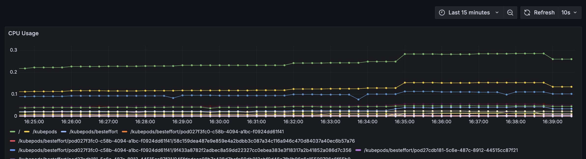
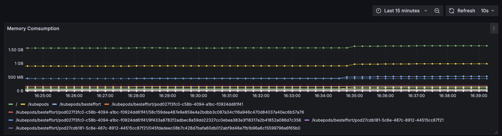
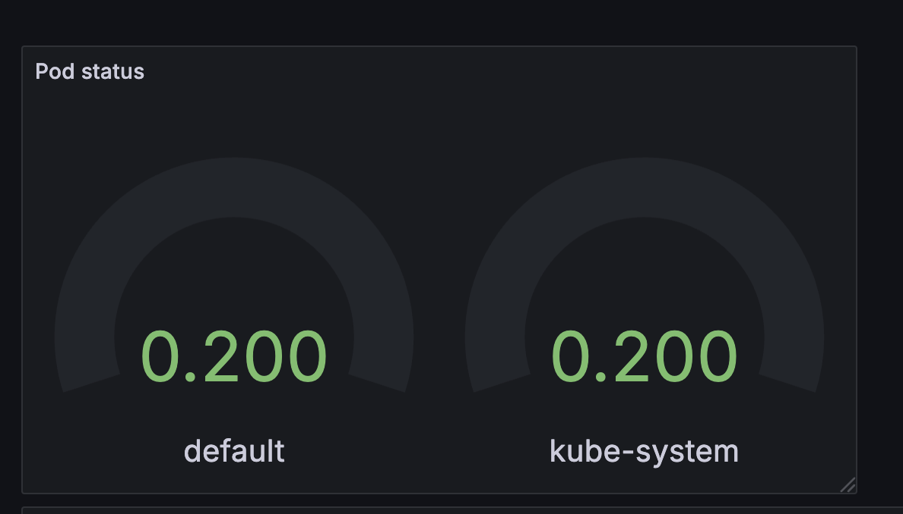
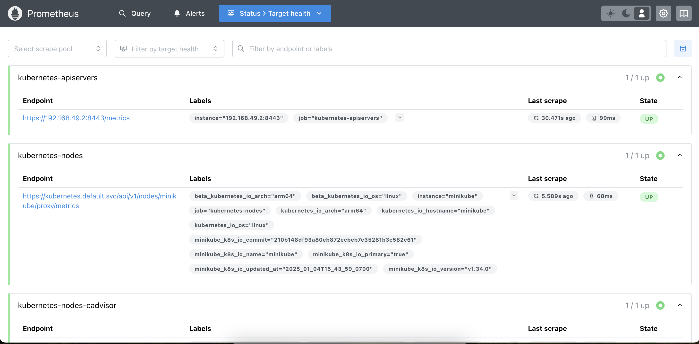

# Kubernetes Auto-Healing Cluster with Monitoring

This project demonstrates the deployment of an auto-healing Kubernetes cluster integrated with monitoring tools like Prometheus and Grafana. It includes automated pod deletion for testing auto-healing and monitors pod metrics using Prometheus and Grafana dashboards.

---

## **Features**
1. Kubernetes cluster setup with Nginx deployment. Here Nginx mocks a service which is to be monitored with the help of the said monitoring tools. 
2. Monitoring using Prometheus and Grafana.
3. Python script to simulate pod auto-healing by deleting pods periodically.
4. Automation of the entire setup process using a Bash script.
(Extra) 5. Deploy to docker. Dockerfile included. 

---


Displays the real-time CPU usage of the Kubernetes nodes and pods, helping to identify any overuse or resource bottlenecks.


Visualizes memory usage across pods and nodes, which is critical to ensure that no component is using excessive memory, leading to potential crashes or slowdowns.


Tracks the health of pods, showing the number of pods that are running, pending, or in an error state, allowing you to monitor pod availability and take proactive actions like restarting or scaling pods if needed.


Homepage of the Prometheus dashboard


## **Project Structure**

```plaintext
.
├── Dockerfile                   # Dockerfile for Python scripts
├── README.md                    # Project documentation
├── bash-scripts
│   └── setup_cluster.sh    	 # Bash script to automate setup
├── k8s
│   ├── nginx-deployment.yaml    # Nginx deployment file
│   ├── nginx-service.yaml       # Nginx service file
├── python-scripts
│   ├── delete_pod_simulation.py # Python script to delete pods periodically
│   └── pod_metrics_collector.py # (Optional) Collect pod metrics
│   └── pod_health_check_and_restart.py # (Optional) Checking the health of the pods and auto restart if dead
└── requirements.txt             # Python dependencies
```

---

## **Step-by-Step Instructions**

### 1. **Prerequisites**
- Install the following tools on your system:
  - Docker
  - Minikube
  - Helm
  - Python 3.x
  - `kubectl` command-line tool

---

### 2. **Clone the Repository**
Clone this project repository to your local machine:

```bash
git clone <repository-url>
cd <repository-folder>
```

---

### 3. **Build the Docker Image**
Navigate to the root directory and build the Docker image for the Python scripts:

```bash
docker build -t auto-healing-python:latest .
```

---

### 4. **Run the Automated Bash Script**
Run the `setup_cluster.sh` script to automate the setup of the entire project.

```bash
bash bash-scripts/setup_cluster.sh
```

#### **What the Script Does:**
1. Starts a Minikube cluster.
2. Deploys Prometheus and Grafana using Helm.
3. Deploys the Nginx application on Kubernetes.
4. Sets up port-forwarding for Prometheus, Grafana, and Nginx.
5. Runs the Python script to delete pods every 1 minute.

---

### 5. **Access the Monitoring Tools**
- **Grafana:**
  Open Grafana in your browser at `http://localhost:3000` and log in with:
  - Username: `admin`
  - Password: Retrieved during script execution.

- **Prometheus:**
  Open Prometheus in your browser at `http://localhost:9090`.

- **Nginx:**
  Access the Nginx application at `http://localhost:8080`.

---

### 6. **Python Script for Pod Auto-Healing**
The `delete_pod_simulation.py` script runs every 1 minute and deletes a random pod in the Nginx deployment to test Kubernetes' self-healing functionality.

---

## **Manual Setup Instructions**
If you prefer to set up everything manually, follow these steps:

1. **Start Minikube:**
   ```bash
   minikube start --driver=docker
   ```

2. **Install Prometheus:**
   ```bash
   helm install prometheus prometheus-community/prometheus
   ```

3. **Install Grafana:**
   ```bash
   helm repo add grafana https://grafana.github.io/helm-charts
   helm repo update
   helm install grafana grafana/grafana
   ```

4. **Retrieve Grafana Password:**
   ```bash
   kubectl get secret --namespace default grafana -o jsonpath="{.data.admin-password}" | base64 --decode
   ```

5. **Deploy Nginx:**
   ```bash
   kubectl apply -f k8s/nginx-deployment.yaml
   kubectl expose deployment nginx-deployment --type=NodePort --port=80
   ```

6. **Set Up Port-Forwarding:**
   ```bash
   kubectl port-forward service/prometheus-server 9090:80 &
   kubectl port-forward service/grafana 3000:80 &
   kubectl port-forward service/nginx-deployment 8080:80 &
   ```

7. **Add Prometheus as Grafana Data Source:**
   Set the URL to `http://prometheus-server.default:80` in Grafana.

8. **Run the Python Script:**
   Execute `delete_pod_simulation.py` manually or automate it as described earlier.

---

## **Technologies Used**
- **Kubernetes:** Orchestrating the Nginx deployment and auto-healing.
- **Prometheus:** Monitoring pod metrics.
- **Grafana:** Visualizing pod metrics with dashboards.
- **Python:** Automating pod deletion.
- **Helm:** Simplified deployment of Prometheus and Grafana.

---

## **Future Improvements**
1. Use Kubernetes CronJobs to replace the Bash-based periodic Python script execution.
2. Add more monitoring features, such as alerting and advanced dashboards.
3. Enable horizontal pod auto-scaling for dynamic load management.

---
